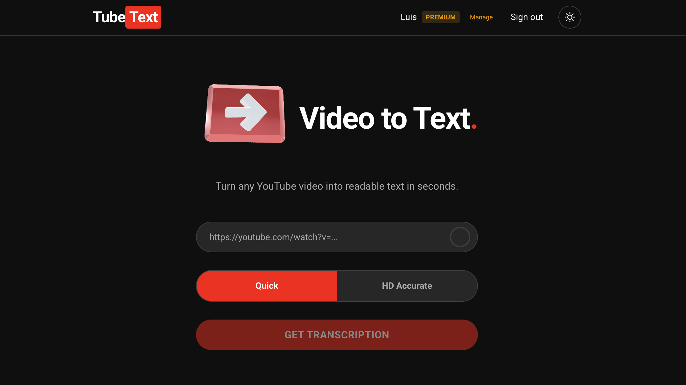

# TubeText

Get transcripts, summaries, and translations from any YouTube video.

**Try it live:** [www.tubetext.app](https://www.tubetext.app)

## Why

YouTube is one of the richest sources of knowledge on the internet — tutorials, lectures, interviews, deep dives on any topic. But most videos are long, full of filler, and hard to skim.

TubeText extracts the content that matters. Paste a link, get the full transcript in seconds. Summarize it. Translate it. Download it. Feed it to an LLM to study, research, or build on top of someone else's expertise — without watching a 40-minute video.



## Features

- **Transcription** — Extract captions from any YouTube video
- **Premium Transcription** — Audio-based transcription via Deepgram when captions aren't available
- **AI Summary** — Get key takeaways powered by OpenAI GPT-4 mini
- **AI Translation** — Real-time streaming translation to 20+ languages via Cerebras
- **PDF Export** — Download formatted transcripts as PDF
- **Auth & Billing** — Google OAuth + Stripe subscriptions (free tier included)

## Infrastructure

The app runs as three services on Railway:

<!-- Add Railway diagram screenshot here -->
<!--  -->

| Service | Domain | Role |
|---------|--------|------|
| **PostgreSQL** | — | Stores users, OAuth accounts, and subscription data (persistent volume) |
| **TubeText Backend** | `api.tubetext.app` | FastAPI server — handles transcription, AI calls (OpenAI, Cerebras, Deepgram), auth, and payments |
| **TubeText Frontend** | `tubetext.app` | Next.js app — the UI users interact with |

## Tech Stack

| Layer | Technology |
|-------|-----------|
| Frontend | Next.js 16, React 19, Tailwind CSS 4, TypeScript |
| Backend | FastAPI, Python 3.12, SQLAlchemy (async), Alembic |
| Database | PostgreSQL (asyncpg) |
| Auth | Google OAuth + JWT (HTTP-only cookies) |
| AI | OpenAI, Cerebras, Deepgram |
| Payments | Stripe |
| Email | Resend |
| Deployment | Railway (Docker) |

## Getting Started

### Prerequisites

- Python 3.12+
- Node.js 18+
- PostgreSQL
- ffmpeg

### Backend

```bash
cp .env.example .env  # fill in your keys
pip install .
uvicorn main:app --reload
```

### Frontend

```bash
cd frontend
cp .env.local.example .env.local  # set NEXT_PUBLIC_API_URL
npm install
npm run dev
```

### Docker (backend only)

```bash
docker build -t tubetext .
docker run -p 8000:8000 --env-file .env tubetext
```

## Environment Variables

See [`.env.example`](.env.example) for all required backend variables and [`frontend/.env.local.example`](frontend/.env.local.example) for frontend config.

## Contact

For questions, feedback, or business inquiries — **contact@tubetext.app**

## License

This project is licensed under the Apache License 2.0 — see the [LICENSE](LICENSE) file for details.
